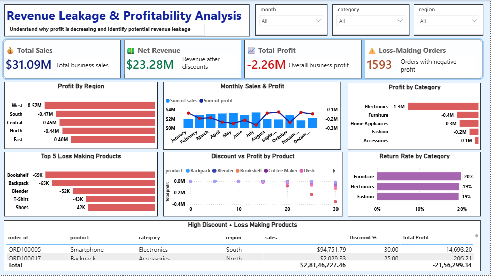
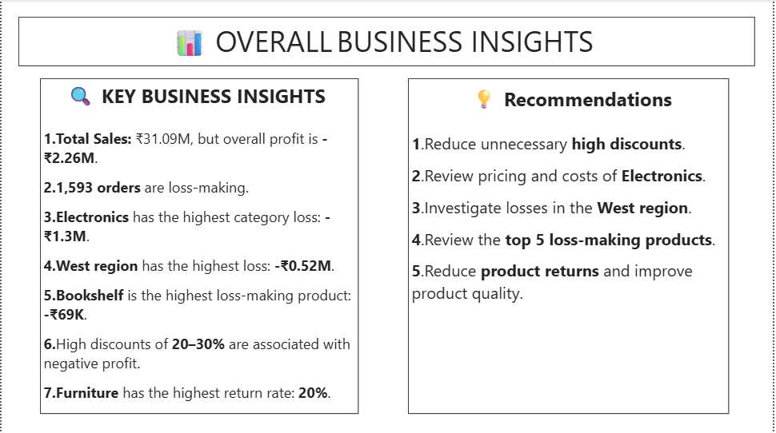

# Revenue Leakage & Hidden Profit Loss Detection

## 📌 Project Overview

Revenue leakage is the loss of potential revenue or profit due to factors such as high discounts, increasing costs, loss-making orders, and low-profit products.

This project focuses on identifying **revenue leakage and hidden profit loss** using Data Analytics techniques.

The project analyzes business sales data to understand sales, profit, loss, products, and orders and provides useful business insights and recommendations.

---

## 🎯 Business Problem

Businesses may generate good sales but still experience low profit.

This can happen because of:

* High product costs
* Excessive discounts
* Loss-making orders
* Low-profit products
* High business expenses
* Poor-performing products
* Other factors affecting profitability

The main purpose of this project is to identify these problems using data and find areas where the business can improve its profit.

---

## 🎯 Project Objectives

The main objectives of this project are:

1. Analyze total sales.
2. Analyze total profit and loss.
3. Identify profitable products.
4. Identify loss-making products and orders.
5. Find the top 10 profitable products.
6. Analyze business performance.
7. Identify possible revenue leakage.
8. Create a Power BI dashboard.
9. Generate useful business insights.
10. Provide data-driven recommendations.

---

## 🛠️ Tools & Technologies

* Python
* Pandas
* NumPy
* Matplotlib
* SQL
* PostgreSQL
* pgAdmin
* Power BI
* Excel
* GitHub

---

## 📊 Dataset

The project uses business order and sales data.

The dataset contains information related to:

* Order ID
* Order Date
* Customer ID
* Product
* Category
* Region
* City
* Quantity
* Unit Price
* Sales
* Discount
* Cost
* Delivery Cost
* Return Status
* Payment Method
* Payment Status
* Order Status

---

# 🔄 Project Workflow

```text
Raw Business Data
        ↓
Data Cleaning
        ↓
Data Preparation
        ↓
Python Analysis
        ↓
SQL Analysis
        ↓
Profit & Loss Analysis
        ↓
Revenue Leakage Detection
        ↓
Power BI Dashboard
        ↓
Business Insights
        ↓
Recommendations
```

---

# 🐍 Python Analysis

Python was used for data cleaning, preparation, and analysis.

### Python Tasks

* Loaded the dataset using Pandas
* Checked the dataset structure
* Checked missing values
* Cleaned the data
* Checked duplicate records
* Corrected data types
* Converted date columns
* Performed data analysis
* Analyzed sales
* Analyzed profit and loss
* Identified business problems

The complete Python analysis is available here:

```text
python/loss detection.ipynb
```

---

# 🗄️ SQL Analysis

SQL was used to perform business-oriented analysis.

The SQL analysis includes:

* Total Sales
* Total Profit/Loss
* Top 10 Profitable Products
* Loss-Making Orders
* Product Analysis
* Business Performance Analysis

SQL was used to convert raw business data into meaningful information for decision-making.

---

# 📈 Power BI Dashboard

A Power BI dashboard was created to visualize business performance.

The dashboard helps analyze:

* Sales
* Profit/Loss
* Product Performance
* Profitable Products
* Loss-Making Orders
* Business Insights

### Dashboard

**Image Path:**

```text
screenshots/dashboard.png
```



---
### INSIGHTS



# 🔎 Business Analysis

## 1. Total Sales Analysis

Total sales were analyzed to understand the overall revenue generated by the business.

**Image Path:**

```text
screenshots/Total%20sale.png
```


### SQL Output

**Image Path:**

```text
screenshots/Total%20sale%20output.png
```


---

## 2. Total Profit/Loss Analysis

Total profit and loss were analyzed to understand the financial performance of the business.

**Image Path:**

```text
screenshots/Total%20profit%20loss.png
```


### SQL Output

**Image Path:**

```text
screenshots/Total%20profit%20loss%20output.png
```


---

## 3. Top 10 Profitable Products

The top 10 profitable products were identified to understand which products contribute the most to business profitability.

**Image Path:**

```text
screenshots/Top%2010%20profitable%20products.png
```


### SQL Output

**Image Path:**

```text
screenshots/Top%2010%20profitable%20products%20output.png
```


---

## 4. Loss-Making Orders

Loss-making orders were analyzed to identify orders where the business generated negative profit.

**Image Path:**

```text
screenshots/loss%20making%20orders.png
```


### SQL Output

**Image Path:**

```text
screenshots/loss%20making%20orders%20output.png
```


---

# 💡 Business Insights

The analysis provides several useful business insights.

### 1. Profitable Products

The analysis identifies products that contribute significantly to business profit.

These products can be monitored and promoted to improve overall profitability.

### 2. Loss-Making Orders

Loss-making orders can reduce the overall profit of the business.

These orders should be investigated to understand the reason for the loss.

### 3. Cost Impact

High product costs can reduce the profit generated from each sale.

Therefore, businesses should regularly monitor costs.

### 4. Discount Impact

High discounts can increase sales but can also reduce profit margins.

Businesses should provide discounts carefully and monitor their effect on profitability.

### 5. Revenue Leakage

Revenue leakage can occur when expected business profit is reduced because of:

* High costs
* Excessive discounts
* Loss-making orders
* Low-profit products
* Other unnecessary expenses

---

# 💼 Business Recommendations

Based on the analysis, the following recommendations can help improve business performance:

### 1. Monitor Loss-Making Orders

Regularly identify and investigate orders that generate negative profit.

### 2. Control Discounts

Avoid unnecessary high discounts that reduce profit margins.

### 3. Focus on Profitable Products

Promote products that generate higher profit.

### 4. Control Costs

Regularly monitor product and other business costs.

### 5. Improve Product Performance

Review low-profit products and identify whether their price, cost, or demand needs improvement.

### 6. Monitor Revenue Leakage

Create regular reports to identify areas where potential revenue or profit is being lost.

### 7. Use Data for Decision-Making

Use SQL analysis and Power BI dashboards to make business decisions based on data.

---

# 📊 Dashboard & Insights

## Power BI Dashboard

**Image Path:**

```text
screenshots/dashboard.png
```


---

## Business Insights

**Image Path:**

```text
screenshots/insights.png
```


---

# 📂 Project Structure

```text
revenue-leakage-profit-loss-analysis/
│
├── data/
│   └── revenue_leakage_data.csv
│
├── python/
│   └── loss detection.ipynb
│
├── sql/
│   └── revenue_leakage_queries.sql
│
├── powerbi/
│   └── revenue_leakage_dashboard.pbix
│
├── screenshots/
│   ├── dashboard.png
│   ├── insights.png
│   ├── Total sale.png
│   ├── Total sale output.png
│   ├── Total profit loss.png
│   ├── Total profit loss output.png
│   ├── Top 10 profitable products.png
│   ├── Top 10 profitable products output.png
│   ├── loss making orders.png
│   └── loss making orders output.png
│
├── presentation/
│   └── revenue_leakage_project.pptx
│
└── README.md
```

---

# ⭐ Skills Demonstrated

This project demonstrates practical skills in:

* Data Cleaning
* Data Analysis
* Exploratory Data Analysis
* Business Analytics
* Python
* Pandas
* NumPy
* SQL
* PostgreSQL
* Power BI
* Data Visualization
* Profit & Loss Analysis
* Sales Analysis
* Revenue Analysis
* Business Problem Solving
* Data-Driven Decision Making

---

# 🚀 Project Outcome

This project demonstrates how raw business data can be converted into meaningful business insights using Python, SQL, and Power BI.

The analysis helps identify:

```text
Sales
  ↓
Profit / Loss
  ↓
Profitable Products
  ↓
Loss-Making Orders
  ↓
Potential Revenue Leakage
  ↓
Business Insights
```
